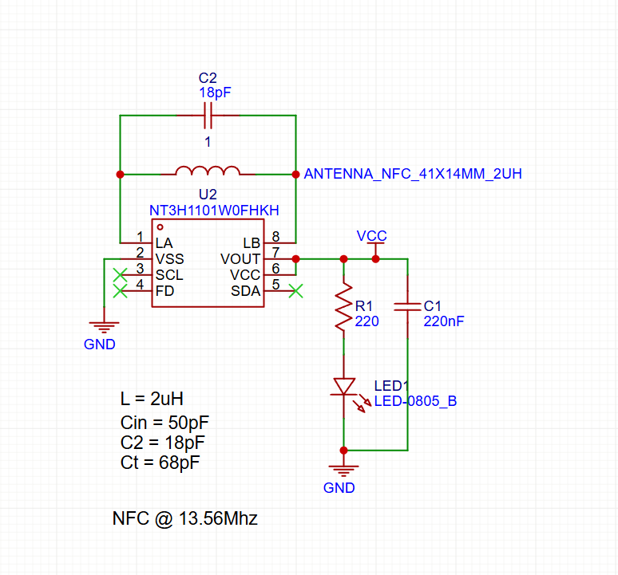
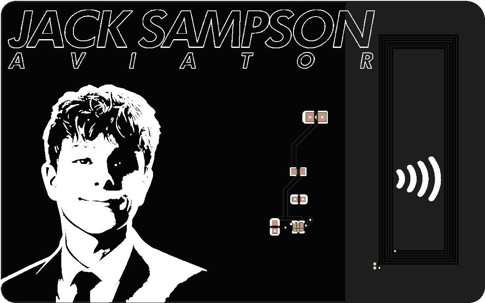

---

Title: "PCB business card w/ copper qr code & power harvesting nfc"

Author: "Jack Sampson"
Description: "A PCB business card w/ a copper qr code on the back and an nfc chip on the front that lights an LED thru power harvesting when tapped."

Created_at: "2026-05-13"

---

# May 13: Made a PCB business card from scratch

Today, i made a PCB business card that does two things: includes a qr code etched in copper on the back, and has an nfc chip on the front that will light a small LED using power harvesting when a person taps their phone to the card.

## QR code

I wanted to make sure to avoid those online qr generators that lock up all of the useful features behind a pay wall. So, i wrote a custom script to generate my own qr code using claude. That was very satisfying, because i was able to put rounded corners on the modules and be able to place a logo in the center of the qr code, neither of which i could do using any of the free online generators. I also had claude help me determine some of the lesser known options available for creating non-standard designs with the qr matrix.

### NFC side

This is where i struggled the most. I don’t know too much about nfc, and i felt like there were few resources available for beginners who are looking to design an nfc antenna and matching circuit for a card. I worked on building it from scratch for quite a long time before finally finding an open source version on GitHub that met my needs. I then adjusted it to meet my specific requirements and fixed a couple of issues that were present in the original.

### Front design

For the front of the card: black PCB, white silkscreen. I created the design in Photoshop, and then i had chatgpt create an image of one of my head shots in halftones that would be suitable for printing onto silkscreen. The tap point for the nfc chip is located on the right hand side of the card, adjacent to the LED.

### How it works

My nfc chip is capable of utilizing power harvesting, therefore, it can capture just enough energy from the RF field to operate an LED. Anytime somebody taps their phone against the card, the LED turns on. This may seem like a minor detail, however, i believe/hope it will be a big hit.

### Realistic assessment

Longer than i expected. Even simple tasks take longer than they probably should due to easyeda’s steper learning curve, combined with my limited experience with the software. Additionally, i found the documentation regarding nfc to be more frustrating than helpful since i could not locate any information that was both reliable and applicable. As such, i relied upon an existing open source project. While i am still unfamiliar with many aspects of the circuit compared to yesterday when i began this task, i feel that i understand them much better now. My qr code generator also produced results far superior to what would’ve been generated by either a free or paid program.

**time spent total: 2 hours**